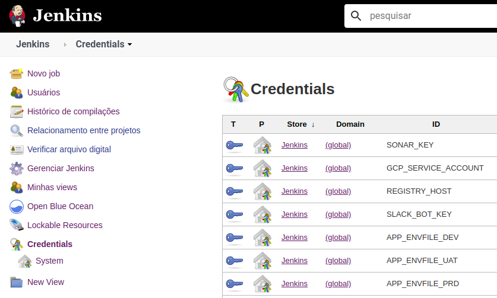
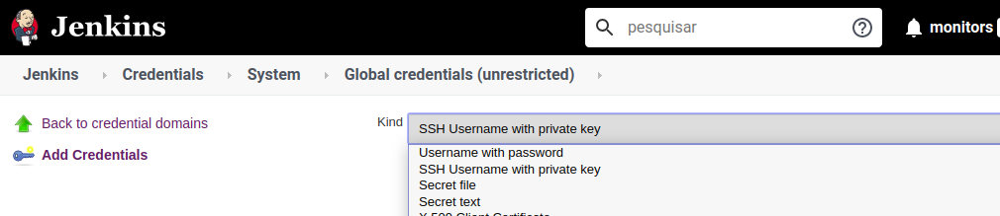
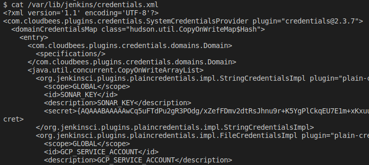

# Jenkins Credentials.

## Objetivo.

O objetivo deste repositório é fornecer um compilado de todo meu conhecimento sobre credenciais no Jenkins.

---

## Porque utilizar as credenciais?

Caso você esteja começando na área de Desenvolvimento ou DevSecOps acho que essa seria a primeira pergunta com relação a importancia deste conteúdo.

Vamos partir do ponto mais importante, credenciais foram feitas para serem secretas.

Partindo deste ponto temos que utilizar todo processo e ferramentas que nos ajudem nesta missão.

***"Marretar"*** usuário e senha, token de acesso a API no código da aplicação ou versionar chaves de SSH é uma prática ***não recomendada***. Pois mesmo se você correr agora para apaga-los com o histórico dos seus versionamentos podemos resgata-los. Quando falamos de credencial todo esforço para protege-la é válido.

Credenciais devem ser armazenadas de criptografada e quando utilizadas não podem ser expostas ao usuário, o sistema de credenciais do Jenkins faz isso para você.

---

## Sobre os exemplos.

Separei em 6 partes e estão ordenadas por onde comecei até como utilizo hoje na manutenção das credenciais:

1. **UI** *(/jenkins-ui)*:
Manutenção das credencias pela interface gráfica do Jenkins

2. **CLI** *(/jenkins-cli)*: Manutenção das credenciais pela linha de comando utilizando o jenkins-cli.jar

3. **API** *(/jenkins-api)*: Manutenção das credenciais pela API via HTTP.

4. **Groovy** *(/jenkins-groovy)*: Manutenção das credenciais via console de script Groovy.

5. **AsCode**: *(/jenkins-as-code)*: Manutenção das credenciais via plugin Jenkins Configuration as Code (JCasC) utilizando definições por aquivos YAML.

6. **Pipeline**: *(/jenkins-pipeline)*: Utilização das credenciais nas esteiras de CI/CD e demais jobs auxiliares.

---

Em toda as partes foco na utilização das credenciais mais comuns:

- Texto
- Arquivo
- Usuário e Senha
- Chave privada SSH

O Jenkins suporta inúmeros tipos de credenciais depedendo dos plugins instalados. Acredito que uma vez entendendo esses 4 tipos básicos, os demais tipos não serão nenhum segredo!

Dentro de cada parte existe um README onde explico de forma mais detalhada como funciona e como utilizar.

---

## Como funciona as credenciais no Jenkins?

As credenciais no jenkins são armazenadas em arquivo XML. Os valores das credenciais estão criptografados e necessitam o ID do Jenkins para realizar a reversão e utilizar durante a execução dos trabalhos.

Caso você copie o arquivo XML para um outro Jenkins este não vai conseguir utiliza-las pois tem outro ID.

O arquivo principal fica na home do Jenkins ex.: `/var/lib/jenkins/credentials.xml`

---

## A beleza em utilizar pastas e credenciais.

Há algum tempo venho utilizando o plugin de pastas, além de deixar tudo mais organizado esse plugin flexibilizou a utilização e elevou o nível de segurança das credenciais.

### Flexibilização.

Para facilitar o entendimento vou exemplificar da seguinte forma. 

Imagine o cenário onde sua aplicação precisa ser entregue em 3 ambientes: desenvolvimento, homologação e produção. 

Então criamos 3 pastas uma para cada ambiente e dentro de cada pasta criamos o job responsável pela entrega.

O job além de realizar a entrega notifica todos os passos pelo slack. Isso obriga termos uma chave de API do slack comum para todos os ambintes.

O job necessita de credenciais específicas como chaves de acesso aos clusters para realizar a entrega em cada ambiente.

Então temos a necessidade de 1 credencial comum para o slack (SLACK_TOKEN) e 3 chaves específicas para os clusters (CLUSTER_KEY).

Vamos criar como global a credencial SLACK_TOKEN e para acesso aos clusters vamos criar em cada pasta a credencial CLUSTER_KEY com o respectivo valor que dá acesso aquele determinado ambiente.

Em nosso job podemos utilizar a credencial SLACK_TOKEN para enviar as notificações e para o acesso ao cluster utilizaremos a credencial CLUSTER_KEY. Como o job foi criado dentro da respectiva pasta do ambiente ele vai obter o valor correto mesmo utilizando o mesmo nome de credencial.

A combinação de credenciais e pastas fornece o valor da credencial mais proxima ao job. Então no caso de termos uma credencial chamada API_KEY no global e um job tambem na raiz que utiliza a credencial API_KEY vai obter o valor definido na credencial armazenada na raiz.

No caso da mesma credencial API_KEY for redefinida dentro de uma pasta somente jobs criados dentro da pasta vão ter acesso ao seu valor.

### Aumento da Segurança.

Abaixo em "Considerações de Segurança" exemplifico a extração de uma credencial via Pipeline DSL ou como código. Para evitar esse tipo de extração podemos organizar tanto as credenciais quanto os jobs em pastas e segmentar o acesso dos usuários a estas pastas.

Então no caso de um usuário mal intensionado que tenha privilégios para criar pipelines, ele somente irá extrair os valores das credenciais que estão na pasta ao qual tem acesso.

Caso vários usuários utilizem o seu jenkins recomendo que evite armazenar credencial na raiz do sistema de credenciais.

---

## Considerações de segurança.

1. Como o arquivo contendo as credenciais e o ID do Jenkins ficam na home da instalação uma vez que o usuário tem acesso a "barriga da maquina", com um pouco de trabalho ele consegue decriptografar e obter os valores das credenciais. Então é super importante que somente usuário administradores tenham esse tipo de acesso.

2. O Console de Script localizado na área de gerenciamento fornece a funcionalidade de acesso a instancia do Jenkins utilizando scripts Groovy. Com esse acesso podemos criar, atualizar, excluir, listar e extrair os valores das credenciais. Outro ponto super importante, somente usuário administradores devem ter acesso a este recurso.

3. Pipeline DSL ou como código utilizam-se das credenciais para realizar suas missões, no console log da execução todas as credenciais são substituidas por *****, mas usuários mal intensionados podem utilizar tecnicas para abrir o valor das credenciais e loga-los no console de execução. Ex.: `println env.CREDENTIAL_A.collect { it }`, esse comando vai listar o valor da credencial com cada caracter separado por uma virgula. Organizar suas credenciais por pastas e restringir o acesso dos usuários a criação de Pipelines (fornecendo pipelines prontas) pode ser um bom caminho.

4. Evite ao máximo colocar seu Jenkins com a "***bunda pra rua***" ou sejá trabalhe com o Jenkins dentro de uma rede privada onde o acesso seja por VPN. Como o Jenkins armazena as credenciais que fornecem acesso aos seus ambientes mais críticos cuide dele como se fosse um de seus mais precisos ativos!

---

## Considerações finais.

Espero que esse material possa ajudar quem está começando ou mesmo quem nunca se aprofundou no tema de credenciais.

Qualquer dúvida ou sugestão será super bem vinda! Sinta-se avontade para sugerir algo ou perguntar sobre qualquer coisa que não tenha ficado claro.