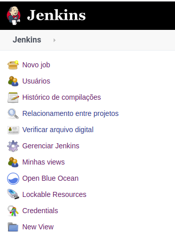
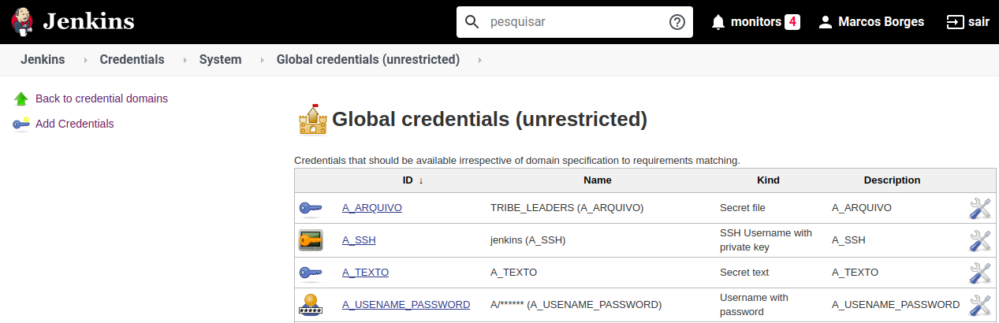
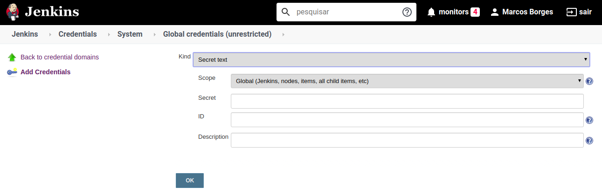
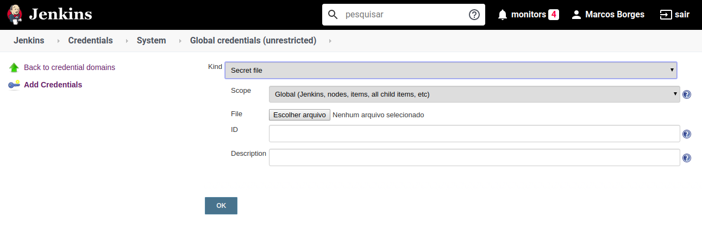
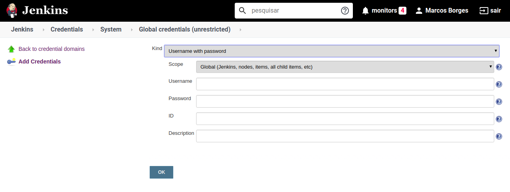
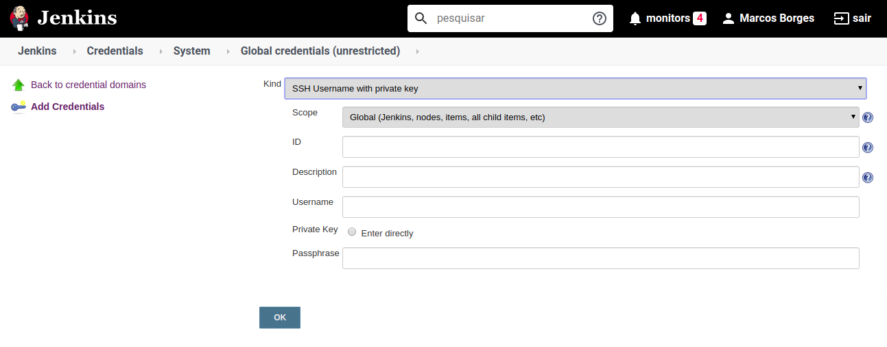

# Jenkins Credentials UI

Manutenção e utilização das credenciais pela interface web do Jenkins.

Você pode chegar na área de gerenciamento de credenciais pelo item "Credentials" localizado no menu esquerdo >> clique em System e depois >> Global credentials (unrestricted).

---

## Tela para manutenção de credenciais.

Nesta tela você tem a opção de criar uma nova credencial clicando no menu esquedo em "Add Credentials", pode também ver as credencias já cadastradas na listagem, através dos itens da exibidos, pode interagir com as credenciais, atualizando ou excluindo-as.

---

### Credencial do tipo texto

Para criar uma credencial do tipo texto no campo Kind selecione "secret text", abaixo vai ser exibido 4 campos:  

- **Scope**: mantenha o global;
- **Secret**: preencha com o valor da credencial;
- **ID**: informe o nome da credencias, não utilize espaços ou caracteres especiais, prefira utilizar maiúsculo e substituir espaços por underline (_);
- **Description**: preencha com uma descrição clara e objetiva para sua credencial.
---

### Credencial do tipo arquivo

Para criar uma credencial do tipo arquivo no campo Kind selecione "secret file", abaixo vai ser exibido 4 campos:  

- **Scope**: mantenha o global;
- **File**: selecione o arquivo que deseja armazenar como credencial;
- **ID**: informe o nome da credencias, não utilize espaços ou caracteres especiais, prefira utilizar maiúsculo e substituir espaços por underline (_);
- **Description**: preencha com uma descrição clara e objetiva para sua credencial.
---

### Credencial do tipo usuário e senha

Para criar uma credencial do tipo arquivo no campo Kind selecione "secret file", abaixo vai ser exibido 5 campos:  

- **Scope**: mantenha o global;
- **Username**: informe o nome de usuário;
- **Password**: informe a senha do usuário;
- **ID**: informe o nome da credencias, não utilize espaços ou caracteres especiais, prefira utilizar maiúsculo e substituir espaços por underline (_);
- **Description**: preencha com uma descrição clara e objetiva para sua credencial.

---

### Credencial do tipo chave privada SSH 

Para criar uma credencial do tipo SSH no campo Kind selecione "secret file", abaixo vai ser exibido 6 campos:  

- **Scope**: mantenha o global;
- **ID**: informe o nome da credencias, não utilize espaços ou caracteres especiais, prefira utilizar maiúsculo e substituir espaços por underline (_);
- **Description**: preencha com uma descrição clara e objetiva para sua credencial.
- **Username**: informe o nome de usuário;
- **Private Key**: preencha o campo com o conteúdo da sua chave privada;
- **Passphrase**: informe a senha do usuário;

---

## Como utilizar?

---

